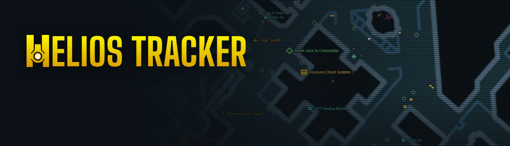
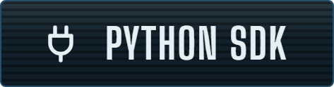
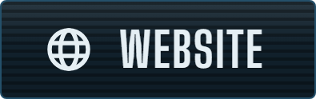

The map of the level you're in, live in your browser: players, enemies, loot and missions, as you play
**Borderlands 2** or **The Pre-Sequel**. On a second screen, a phone, in OBS, in the Steam overlay, or shared with
friends. A mod for the [Python SDK](https://bl-sdk.github.io/).

  
  &nbsp;
  
  &nbsp;
  

## What's on the map

Every kind of marker is a layer you can show, hide or resize:

- players, enemies with their health (bosses outlined in gold), NPCs and allies, vehicles
- missions to pick up or hand in, and your missions' waypoints
- gear in its rarity's color (hover it for its item card), cash, ammo, health, eridium / moonstones, mission items
- chests and containers (click one to see what it can drop), vending machines, slot machines and stations
- explosives, jump pads, oxygen sources, Vault symbols

And more than a map: every player's gear and skill trees as the game's item cards, Gibbed codes, the mission log and
the best missions to do next, the vending machines' stock and restock timer, action skill cooldowns, area names and
fog of war, tilting and turning the map, five color themes, the page in nine languages. In co-op only one player needs it.

## Install

1. Install the [Python SDK](https://github.com/bl-sdk/willow2-mod-manager/releases) (version 3, with the Mods menu
   in game).
2. Download `helios_tracker.sdkmod` from the [latest release](https://github.com/ZooLSmith/helios-tracker/releases/latest).
3. Put it in the game's `sdk_mods` folder (Steam: right-click the game, Manage, Browse local files).
4. Start the game, open **Mods**, enable **Helios Tracker**.
5. In the mod's options press **Open Map in Browser**, or go to <http://localhost:8777/>.

Updates: **Check for Updates** in the mod's options, or turn on **Automatic Updates**. More - your phone, OBS, the
Steam overlay, sharing it over the internet - on the [website](https://helios-tracker.zoolsmith.com/share).

## How it works

The mod (`helios_tracker/`, Python) reads the level and what's in it from the game, runs a small local web server
and streams it to the page (`helios_tracker/web/`, plain HTML / ES modules, no build). It only reads the game and
draws nothing in it. The maps, fonts and icons come from your own game files, read as you play - nothing of the
game's is shipped.

## Development

- `AGENTS.md`: the layout, conventions and workflow (for people and coding agents alike); `.agent/spec.md` the
  spec, `.agent/notes.md` the findings about the game's objects.
- `project.json` (from `project.example.json`): your machine's paths. `python tools/link_mod.py` links the mod into
  the game's `sdk_mods` (edits live in game); `python tools/offline_check.py` checks it outside the game.
- `python tools/build_sdkmod.py` builds the `.sdkmod`; `tools/release.py` publishes a release.

## License

[GPL-3.0](LICENSE). Helios Tracker is a fan-made mod, not made or endorsed by Gearbox Software or 2K. Borderlands
and its names belong to them.
